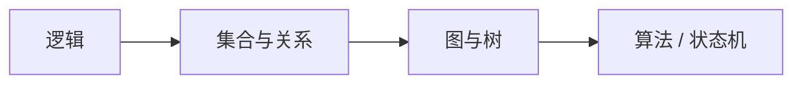

# 离散数学学习路线

> 来源：按可检索历史会话线索整理，部分表达为知识性归纳，非逐字原话。

面向编程与系统设计，建议从命题逻辑、集合、关系、函数、组合计数、图论与证明方法逐层推进。与 Monorepo 依赖图、状态机、数据库关系模型和 Agent 工作流之间建立示例关联。

```mermaid
flowchart LR
 Logic[逻辑] --> Sets[集合与关系]
 Sets --> Graph[图与树]
 Graph --> Algo[算法 / 状态机]
```
